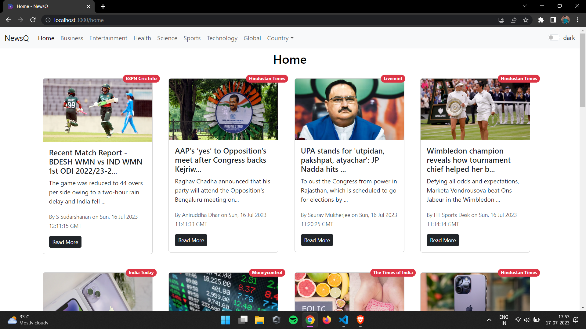
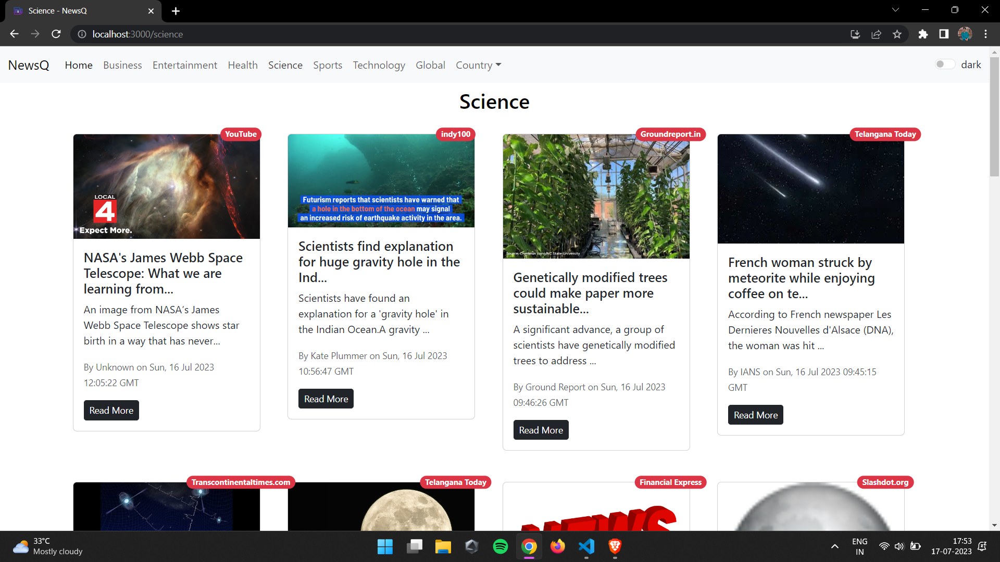
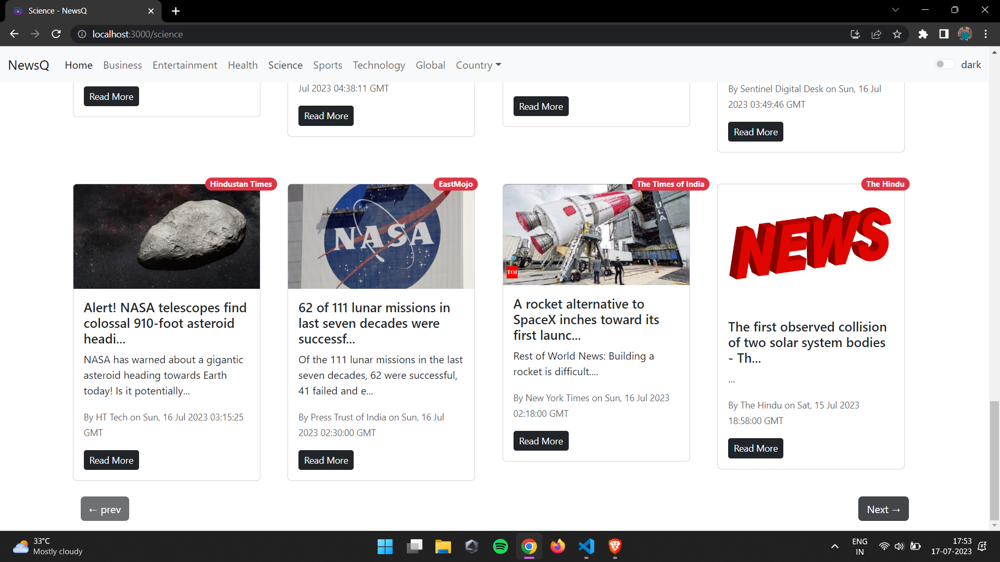
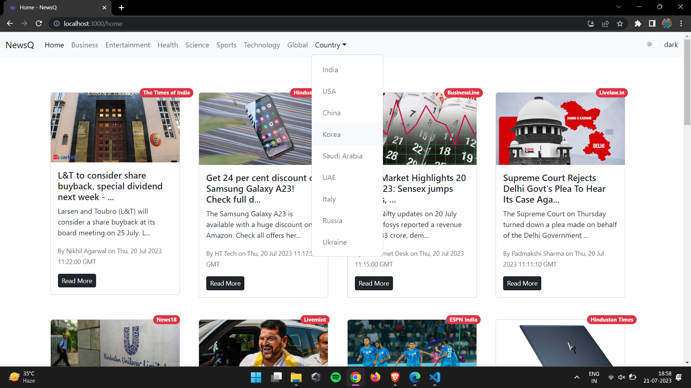
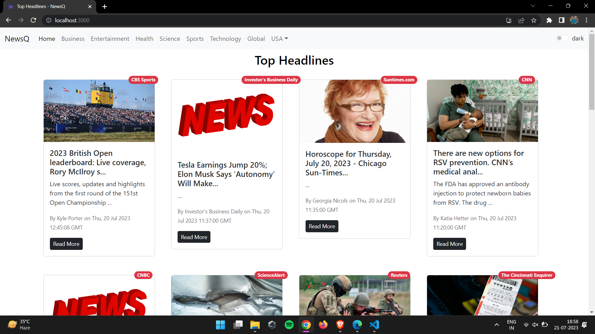
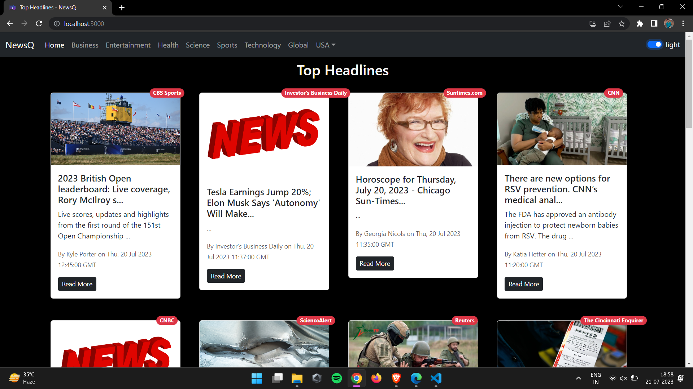
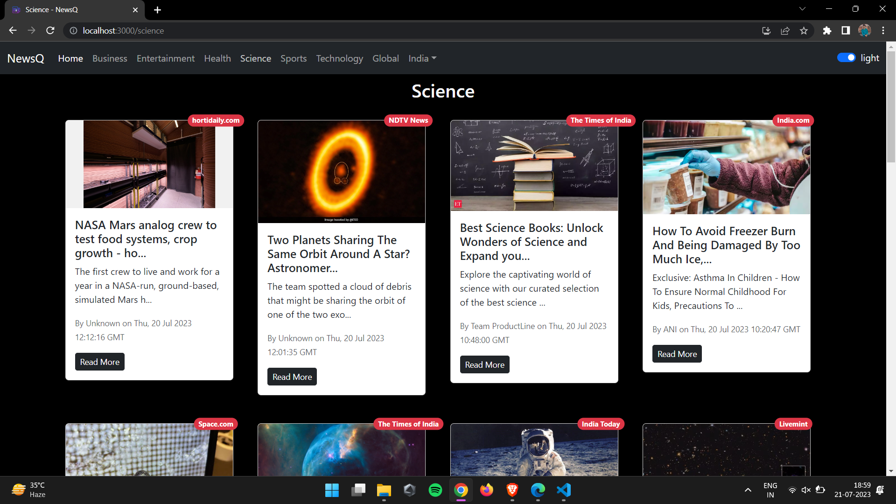
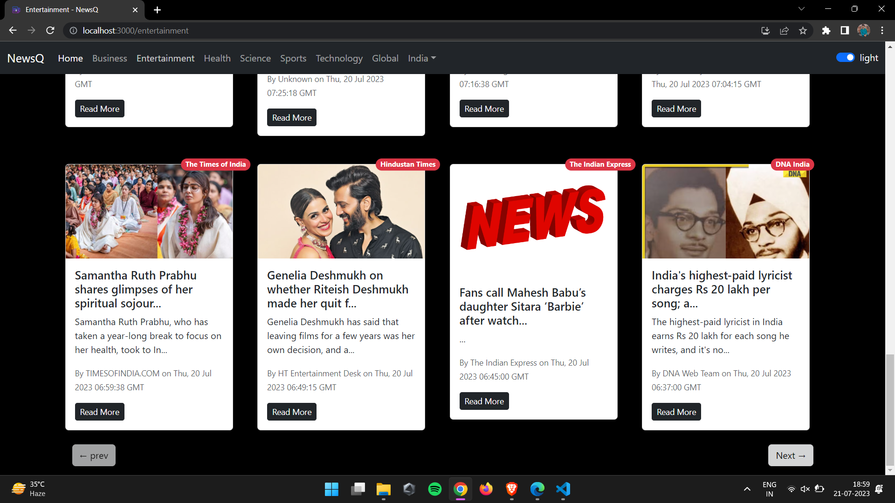

# NewsQ
The NewsApp is a React.js-based news application that fetches data from an API to display news from different categories and countries. It has a user-friendly interface, seamless navigation, and personalized news coverage. The app integrates with a reliable API, delivering up-to-date articles from multiple sources.

## Screenshots

### Select Your country

